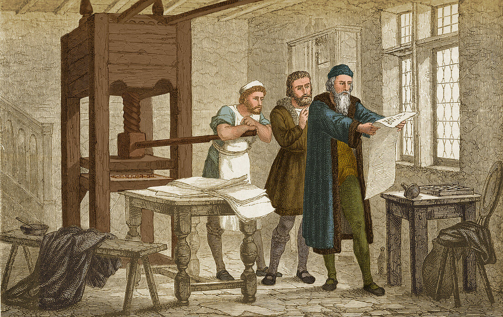

[](https://www.chromatic.com/library?appId=696fd126f0e504f96615dec9&branch=main)
[](https://www.chromatic.com/library?appId=6977e41687a50b30c4349650&branch=main)

[](docs/getting-started/introduction.mdx)

[docs/getting-started/introduction.mdx](docs/getting-started/introduction.mdx)

# Usage

```sh
$ curl -sL https://raw.githubusercontent.com/pmndrs/docs/refs/heads/main/preview.sh | \
  MDX="docs" \
  ICON="🥑" \
  DOCKER_IMAGE="ghcr.io/pmndrs/docs:latest" \
  sh
```

- you can pass any option from [configuration](docs/getting-started/introduction.mdx#Configuration)
- in `DOCKER_IMAGE`, you can specify any `:tag` value from [docs packages](https://github.com/pmndrs/docs/pkgs/container/docs) container registry

# Releasing

Every push to `main` redeploys [docs.pmnd.rs](https://docs.pmnd.rs) via [ci.yml](.github/workflows/ci.yml) — no [changeset](.changeset/) needed for that.

Add one (`pnpm changeset`) only when downstream consumers pinning `pmndrs/docs/.github/workflows/build.yml@v3` or `ghcr.io/pmndrs/docs:v3` should pull the change. It bumps [`package.json`](package.json), tags `vX.Y.Z` + `vX`, and publishes a matching Docker image — so `@v3` resolves to the latest.

TL;DR — site-only tweak: skip. Anything consumers see (workflow, build behavior, templates): add one.

# Test

Visual tests are performed in the cloud, through [chromatic.yml](.github/workflows/chromatic.yml).

<details>

You can also replay locally:

```sh
$ npx playwright test --update-snapshots
$ npx chromatic --playwright --project-token $CHROMATIC_PROJECT_TOKEN
```

</details>
