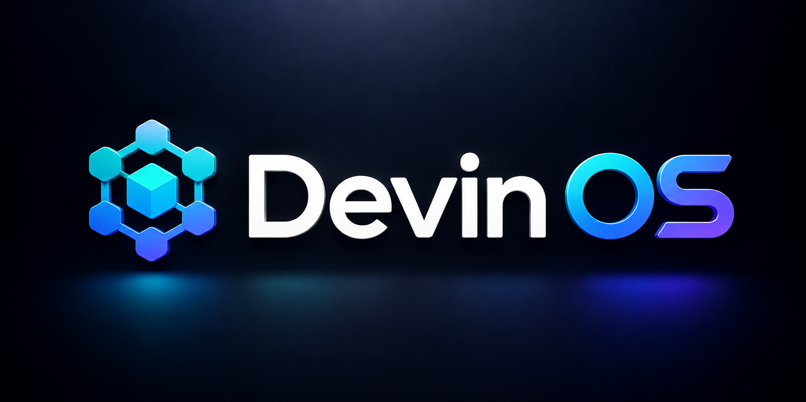

<!-- SEO Meta Tags for GitHub & Social Media -->
<!--
Title: DevinOS - The Ultimate Engineering Operating System for Devin & AI Coding Agents
Description: DevinOS is the world's first open-source Engineering Operating System for AI coding agents. 22+ production-ready skills, 20+ immutable rules, workflows, playbooks, templates, and a self-improving knowledge engine. Free for personal and commercial use.
Keywords: DevinOS, Devin AI, AI coding agent, engineering operating system, software engineering rules, AI prompt engineering, MCP server, Model Context Protocol, Devin skills, AI software development, automated code review, AI debugging, knowledge distillation, self-improving AI, LLM engineering, secure coding, CI/CD automation, Docker best practices, open source AI tools, AI agent framework
Author: Ahmed Hazim
License: MIT
OG Image: https://github.com/ahmedhazim97/DevinOS/raw/main/assets/devinos-banner.png
-->

<p align="center">
  
</p>

<h1 align="center">DevinOS</h1>
<p align="center">
  <strong>The Ultimate Engineering Operating System for Devin & AI Coding Agents</strong><br>
  <em>Transform every Devin installation into a continuously improving Senior Software Engineer</em>
</p>

<p align="center">
  <a href="https://github.com/ahmedhazim97/DevinOS/commits/main"></a>
  <a href="LICENSE"></a>
  <a href="ROADMAP.md"></a>
  <a href="CONTRIBUTING.md"></a>
</p>

---

## Table of Contents

- [What is DevinOS?](#what-is-devinos)
- [Why DevinOS?](#why-devinos)
- [Quick Start](#quick-start)
- [Core Components](#core-components)
- [Engineering Constitution](#engineering-constitution)
- [Priority Hierarchy](#priority-hierarchy)
- [23 Core Skills](#23-core-skills)
- [21 Immutable Rules](#21-immutable-rules)
- [Self-Improving Knowledge Engine](#self-improving-knowledge-engine)
- [Repository Structure](#repository-structure)
- [Quality Gates](#quality-gates)
- [Contributing](#contributing)
- [Roadmap](#roadmap)
- [License](#license)

---

## What is DevinOS?

**DevinOS** is the world's first open-source **Engineering Operating System** built specifically for [Devin](https://www.cognition.ai/devin) and AI coding agents. It is a comprehensive, modular, and self-improving knowledge base that turns every AI-assisted project into a learning opportunity.

Think of it as the "brain upgrade" for Devin: a structured collection of **rules**, **skills**, **workflows**, **playbooks**, **templates**, **memory**, and **prompts** that guide AI agents to write production-grade software with the discipline of a senior engineer.

Unlike generic prompt libraries, DevinOS is:
- **Constitution-Driven** - Every rule derives from the [Engineering Constitution](ENGINEERING_CONSTITUTION.md)
- **Self-Improving** - Learns from every project and grows smarter over time
- **Production-Ready** - Built for real-world software engineering, not toy examples
- **Community-Powered** - Federated learning from thousands of Devin users worldwide

## Why DevinOS?

| Without DevinOS | With DevinOS |
|-----------------|--------------|
| Generic, inconsistent output | Constitution-driven, principled decisions |
| Reinvents the wheel every project | Reuses battle-tested patterns and skills |
| Security overlooked | Security-by-default in every line |
| No memory between sessions | Growing knowledge base from every project |
| No quality standards | Rigorous quality gates for every contribution |
| AI hallucinations unchecked | Verification-before-declaration mandatory |

---

## Quick Start

### 1. Install DevinOS in Any Project (30 seconds)

```bash
# Clone DevinOS
git clone https://github.com/ahmedhazim97/DevinOS.git

# Copy the brain into your project
cp -r DevinOS/.agents ./

# Done. Devin will auto-discover and use the skills and rules.
```

### 2. One-Command Install (Copy-Paste Ready)

```bash
curl -sL https://raw.githubusercontent.com/ahmedhazim97/DevinOS/main/install.sh | bash
```

> Devin will immediately recognize `.agents/skills/` and `.agents/rules/` directories and load them into context.

---

## Core Components

```
DevinOS Brain Structure
|
|-- ENGINEERING_CONSTITUTION.md    # The Supreme Law
|-- .agents/
|   |-- skills/                    # 23+ actionable capabilities
|   |-- rules/                     # 21+ immutable principles
|   |-- workflows/                 # End-to-end processes
|   |-- playbooks/                 # Step-by-step guides
|   |-- memory/                    # Growing knowledge base
|   |-- templates/                 # Implementation starters
|   |-- prompts/                   # Curated prompt library
|
|-- docs/                          # Deep documentation
|-- examples/                      # Working code samples
|-- assets/                        # Media and diagrams
```

---

## Engineering Constitution

The [Engineering Constitution](ENGINEERING_CONSTITUTION.md) is the **supreme law** of DevinOS. Every skill, rule, workflow, and memory entry must derive from it.

### The 10 Articles

1. **Priority Hierarchy** - Correctness > Security > Maintainability > Performance > DX > Readability > Speed
2. **Never Assume** - Verify requirements, code, libraries, tests, documentation
3. **Verification Before Declaration** - No task is complete without evidence
4. **Reuse Over Reinvention** - Search existing code before creating new files
5. **Simplicity** - Keep functions small, files focused, prefer composition
6. **Security by Default** - Validate inputs, escape outputs, never expose secrets
7. **Continuous Learning** - Extract generalizable lessons from every project
8. **Quality Gates** - Uniqueness, documentation, examples, anti-patterns, verification
9. **Git Ethics** - Small focused commits, meaningful messages, no secrets
10. **Human-AI Collaboration** - AI augments humans; decisions must be explainable

---

## Priority Hierarchy

All DevinOS content follows this **immutable** priority order:

```
1. Correctness     -- It must work
2. Security        -- Protect data and users
3. Maintainability -- Easy to understand and modify
4. Performance     -- Fast enough for requirements
5. Developer Experience -- Reduce friction
6. Readability     -- Clear and expressive
7. Speed           -- Deliver quickly
```

No feature, optimization, or shortcut may violate this hierarchy.

---

## 23 Core Skills

Every skill includes: Description, Purpose, Trigger, Context, Workflow, Examples (good & bad), Anti-patterns, Verification Checklist, and References.

### Core Engineering
| Skill | Category | Purpose |
|-------|----------|---------|
| [Planning](.agents/skills/planning/SKILL.md) | Core | Break complex tasks into small, verifiable steps |
| [Architecture Review](.agents/skills/architecture/SKILL.md) | Core | Evaluate and improve architectural decisions |
| [Structured Debugging](.agents/skills/debugging/SKILL.md) | Core | Systematic, evidence-based bug fixing |
| [Code Review](.agents/skills/code-review/SKILL.md) | Core | Evaluate changes for correctness and security |
| [Refactoring](.agents/skills/refactoring/SKILL.md) | Core | Improve structure without changing behavior |
| [Testing](.agents/skills/testing/SKILL.md) | Core | Write comprehensive, deterministic tests |
| [Verification](.agents/skills/verification/SKILL.md) | Core | Rigorous validation before declaring completion |

### Specialized Disciplines
| Skill | Category | Purpose |
|-------|----------|---------|
| [Security Review](.agents/skills/security/SKILL.md) | Security | Systematic vulnerability evaluation |
| [Performance Optimization](.agents/skills/performance/SKILL.md) | Performance | Measure, analyze, and improve with evidence |
| [Documentation](.agents/skills/documentation/SKILL.md) | Core | Write clear, accurate, useful documentation |
| [Git Workflow](.agents/skills/git/SKILL.md) | Core | Professional version control practices |
| [Docker & Containers](.agents/skills/docker/SKILL.md) | DevOps | Build and optimize containerized applications |
| [CI/CD Pipeline Design](.agents/skills/ci-cd/SKILL.md) | DevOps | Automate testing, building, and deployment |
| [Database Design](.agents/skills/database/SKILL.md) | Backend | Design, optimize, and review schemas |
| [API Design](.agents/skills/api-design/SKILL.md) | Backend | Build robust, consistent, developer-friendly APIs |
| [Frontend Engineering](.agents/skills/frontend/SKILL.md) | Frontend | Responsive, accessible, performant UIs |
| [Backend Engineering](.agents/skills/backend/SKILL.md) | Backend | Reliable, scalable, secure server-side systems |

### AI & Operations
| Skill | Category | Purpose |
|-------|----------|---------|
| [MCP Builder](.agents/skills/mcp/SKILL.md) | AI | Build Model Context Protocol servers |
| [AI Engineering](.agents/skills/ai-engineering/SKILL.md) | AI | Build reliable systems leveraging AI |
| [Knowledge Distillation](.agents/skills/knowledge-distillation/SKILL.md) | Meta | Extract reusable lessons from projects |
| [Quality Audit](.agents/skills/quality-audit/SKILL.md) | Meta | Rigorously evaluate assets before acceptance |
| [Incident Response](.agents/skills/incident-response/SKILL.md) | Ops | Systematic response to production incidents |
| [Root Cause Analysis](.agents/skills/root-cause-analysis/SKILL.md) | Core | Determine fundamental causes, not symptoms |

---

## 21 Immutable Rules

Located in `.agents/rules/`, each rule references the Constitution article it derives from and includes a verification checklist.

| # | Rule | Focus |
|---|------|-------|
| 1 | [Engineering Principles](.agents/rules/engineering.md) | Never assume, reuse, keep simple |
| 2 | [Architecture](.agents/rules/architecture.md) | SOLID, composition, loose coupling |
| 3 | [Security](.agents/rules/security.md) | OWASP, input validation, secrets |
| 4 | [Performance](.agents/rules/performance.md) | Profile first, optimize hot paths |
| 5 | [Debugging](.agents/rules/debugging.md) | Reproduce, isolate, root cause |
| 6 | [Planning](.agents/rules/planning.md) | Understand before solving, small steps |
| 7 | [Documentation](.agents/rules/documentation.md) | Update README, explain decisions |
| 8 | [Git](.agents/rules/git.md) | Small commits, meaningful messages |
| 9 | [Testing](.agents/rules/testing.md) | TDD, deterministic, edge cases |
| 10 | [Code Review](.agents/rules/review.md) | Correctness first, constructive |
| 11 | [Communication](.agents/rules/communication.md) | Concise, specific, evidence-based |
| 12 | [UX](.agents/rules/ux.md) | Responsive, accessible, Core Web Vitals |
| 13 | [API Design](.agents/rules/api.md) | Consumer-first, versioning, errors |
| 14 | [Database](.agents/rules/database.md) | Parameterized queries, migrations |
| 15 | [AI Engineering](.agents/rules/ai.md) | Verify output, structured outputs |
| 16 | [MCP](.agents/rules/mcp.md) | Single purpose, validate, document |
| 17 | [Memory](.agents/rules/memory.md) | Generalize lessons, update skills |
| 18 | [Learning](.agents/rules/learning.md) | Extract knowledge, create assets |
| 19 | [Deployment](.agents/rules/deployment.md) | Automated, blue-green, rollback |
| 20 | [Monitoring](.agents/rules/monitoring.md) | Structured logs, actionable alerts |
| 21 | [Quality](.agents/rules/quality.md) | 7-gate audit, scoring rubric, reviewer ethics |

---

## Self-Improving Knowledge Engine

DevinOS is not static. It is designed to **learn and grow** from every project it touches.

### How It Works

```
Every Devin Project
        |
        v
  Knowledge Distillation
        |
        v
  Generalized Lessons
        |
        v
  New Skills / Updated Rules
        |
        v
  Pull Request to DevinOS
        |
        v
  Community Review & Merge
        |
        v
  Every Devin User Benefits
```

### For Individual Users (Private Fork Model)

1. Fork DevinOS into your own private repository
2. Use it across all your projects
3. After each project, Devin asks: **"What did I learn? Can this become a reusable skill?"**
4. Extract lessons, generalize them, and add to your private fork
5. Optionally contribute back to the public DevinOS (opt-in)

### For the Community (Federated Learning)

- Weekly community updates aggregate validated learnings
- High-quality contributions from real projects are merged into the main branch
- Every user who pulls the latest DevinOS gets the collective wisdom of thousands of projects
- No code is ever shared automatically — only generalized, anonymized patterns

### Privacy First

DevinOS **never** auto-uploads your code. The knowledge distillation process:
- Removes all project-specific identifiers
- Generalizes patterns into reusable skills
- Requires explicit opt-in before any contribution
- Keeps your private fork completely under your control

---

## Repository Structure

```
DevinOS/
├── ENGINEERING_CONSTITUTION.md  # Supreme law of DevinOS
├── README.md                     # This file
├── ROADMAP.md                    # Future plans
├── CHANGELOG.md                  # Version history
├── CONTRIBUTING.md               # How to contribute
├── CODE_OF_CONDUCT.md            # Community standards
├── SECURITY.md                   # Security policy
├── .gitignore                    # Cross-platform ignore rules
│
├── .agents/
│   ├── skills/                   # 23+ core skills
│   ├── rules/                    # 21 foundational rules
│   ├── workflows/                # Reusable workflows
│   ├── playbooks/                # Step-by-step guides
│   ├── memory/                   # Knowledge base
│   ├── templates/                # Implementation templates
│   └── prompts/                  # Curated prompts
│
├── docs/                         # Documentation
├── examples/                     # Example implementations
└── assets/                       # Images and media
```

---

## Quality Gates

Every skill must pass these gates before acceptance:

- [ ] **Uniqueness** - No duplicates in the repository
- [ ] **Documentation** - Description, purpose, trigger, context, workflow
- [ ] **Examples** - Good and bad examples included
- [ ] **Anti-patterns** - Common mistakes documented
- [ ] **Verification** - Checklist for correctness
- [ ] **References** - Further reading provided
- [ ] **Framework Agnostic** - General solution unless specific is unavoidable
- [ ] **Production Quality** - No shortcuts, no TODOs without tickets

---

## Contributing

See [CONTRIBUTING.md](CONTRIBUTING.md) for the full guide.

**Quick start:**
1. Read the [Engineering Constitution](ENGINEERING_CONSTITUTION.md)
2. Check [ROADMAP.md](ROADMAP.md) for planned features
3. Search existing issues to avoid duplicates
4. Follow the skill template structure
5. Submit a pull request with clear justification

---

## Roadmap

| Version | Focus | Status |
|---------|-------|--------|
| v0.1 | Foundation - Constitution, Rules, Skills | **Live** |
| v0.2 | Rules & Governance expansion | Planned |
| v0.3 | Skills expansion (50+) | Planned |
| v0.4 | Workflows library | Planned |
| v0.5 | Playbooks (Incident, Security, Optimization) | Planned |
| v0.6 | Memory system | Planned |
| v0.7 | Templates library | Planned |
| v0.8 | Prompt library (100+) | Planned |
| v0.9 | Knowledge graph & searchable index | Planned |
| v1.0 | Public release with community marketplace | Planned |

Full details: [ROADMAP.md](ROADMAP.md)

---

## Keywords

DevinOS, Devin AI, AI coding agent, engineering operating system, software engineering rules, AI prompt engineering, MCP server, Model Context Protocol, Devin skills, Devin rules, AI software development, automated code review, AI debugging, knowledge distillation, self-improving AI, LLM engineering, AI best practices, software architecture, secure coding, CI/CD automation, Docker best practices, frontend engineering, backend engineering, database design, API design, incident response, root cause analysis, AI engineering, open source AI tools, AI agent framework.

---

## License

[MIT](LICENSE) - Free for personal and commercial use.

---

<p align="center">
  <strong>Build with purpose. Verify with rigor. Improve continuously.</strong><br>
  <em>Made for Devin. Built by the community.</em>
</p>
